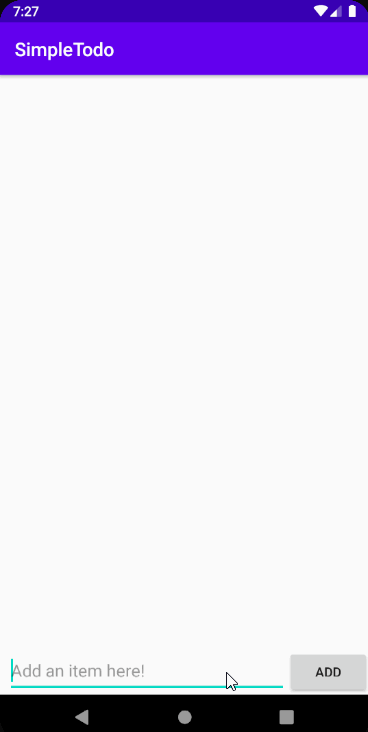

# Project 0 - *Simple Todo*

**SimpleTodo** is an Android app that allows building a todo list and basic todo items management functionality including adding new items, editing and deleting an existing item.

I followed CodePath's YouTube video [playlist](https://www.youtube.com/playlist?list=PLrT2tZ9JRrf6cHOlMkbmTMFt0RzpJiRGX) to develop this project.

This readme is based on CodePath's [template](https://courses.codepath.org/snippets/android_university/readme_templates/project_0_readme.md?raw=true).

Submitted by: **Phillip Dang**

Time spent: **6** hours spent in total

## User Stories

The following **required** functionality is completed:

* [x] User can **view a list of todo items**
* [x] User can **successfully add and remove items** from the todo list
* [x] User's **list of items persisted** upon modification and and retrieved properly on app restart

The following **optional** features are implemented:

* [x] User can **tap a todo item in the list and bring up an edit screen for the todo item** and then have any changes to the text reflected in the todo list

The following **additional** features are implemented:

* [x] User can **leave an item's edit text box blank** to remove an item

## Video Walkthrough

Here's a walkthrough of implemented user stories:

GIF created with [LiceCap](http://www.cockos.com/licecap/).

## Notes

When following CodePath's YouTube video playlist, there were some portions where the instructor's code did not work in newer Android Studio versions.
I successfully implemented similar solutions which worked during my testing.

## License

    Copyright 2020 Phillip Dang

    Licensed under the Apache License, Version 2.0 (the "License");
    you may not use this file except in compliance with the License.
    You may obtain a copy of the License at

        http://www.apache.org/licenses/LICENSE-2.0

    Unless required by applicable law or agreed to in writing, software
    distributed under the License is distributed on an "AS IS" BASIS,
    WITHOUT WARRANTIES OR CONDITIONS OF ANY KIND, either express or implied.
    See the License for the specific language governing permissions and
    limitations under the License.
